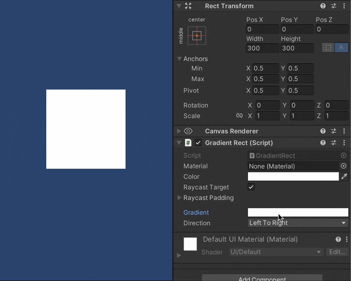

# Gradient Rect
[](https://openupm.com/packages/com.gilzoide.gradient-rect/)

Unity UI components with color [Gradients](https://docs.unity3d.com/ScriptReference/Gradient.html) embedded in their meshes.




## Features
- Uses Unity's built-in Gradient class.
- Supports additional color tint, 2D textures and sprites.
- Supports custom materials and masking.
  Gradient colors are embedded in the generated meshes, the components will never mess with your materials.
- Supports mesh modifiers, like Outline and Shadow.


## How to install
Either:

- Install using [openupm](https://openupm.com/):
  ```
  openupm add com.gilzoide.gradient-rect
  ```

- Install via [Unity Package Manager](https://docs.unity3d.com/Manual/upm-ui-giturl.html) using the following URL:
  ```
  https://github.com/gilzoide/unity-gradient-rect.git#1.0.1
  ```


## Components:
- [GradientRect](Runtime/GradientRect.cs): rectangle colored with Gradient colors.
- [GradientTexture](Runtime/GradientTexture.cs): texture with configurable UV, tinted with Gradient colors.
- [GradientImage](Runtime/GradientImage.cs): sprite tinted with Gradient colors.
  UVs are automatically fetched from sprite data.
  Only simple filling is supported, no slicing nor tiling.